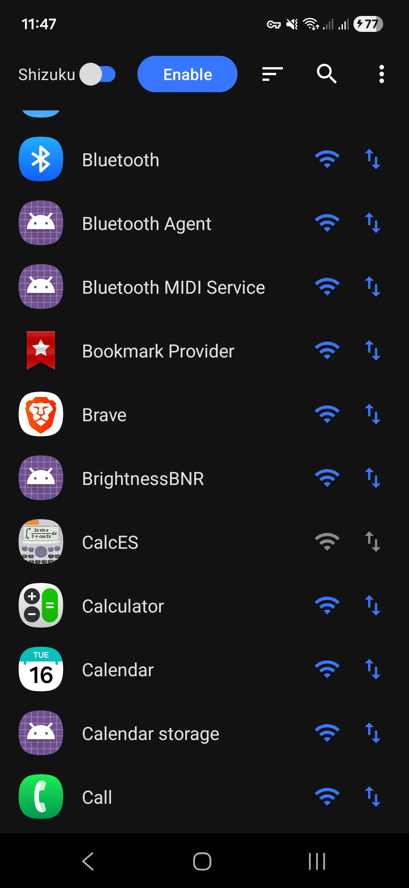
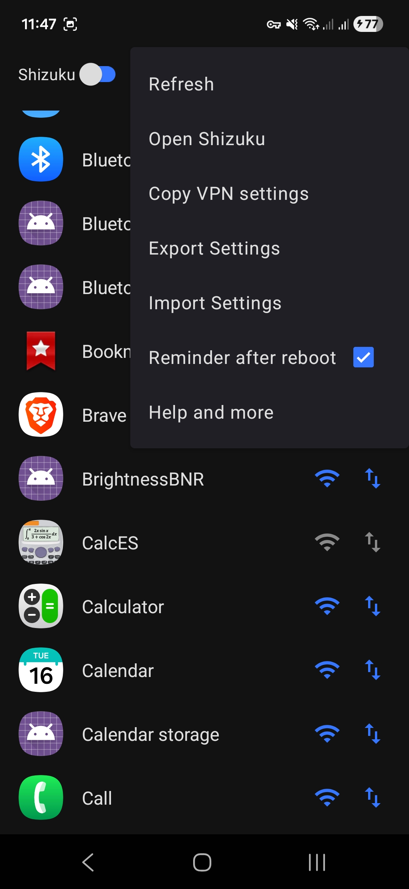
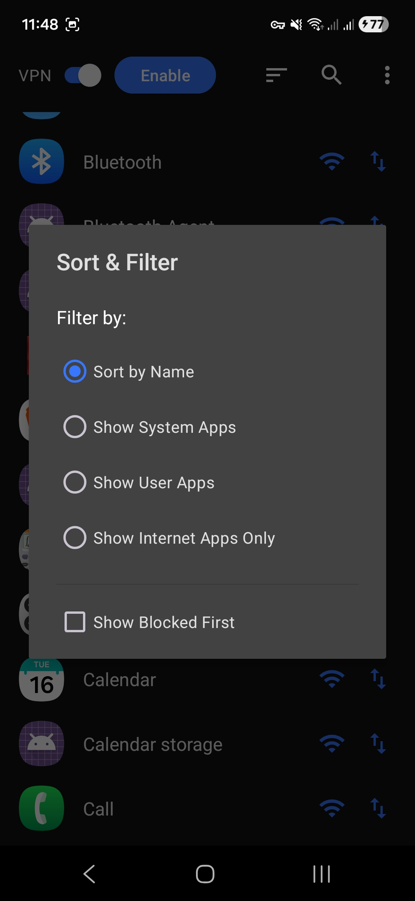
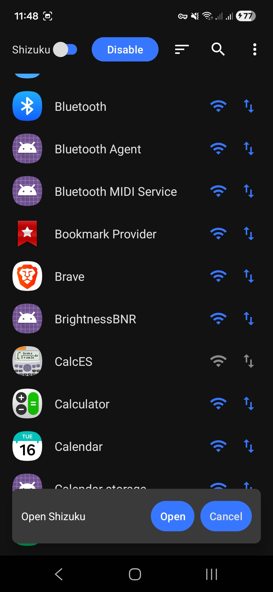

# **FireWall Blocks:** An Android Firewall App (With Shizuku & VPN support)

A simple, open-source Android firewall that blocks app internet access using either Shizuku or a local VPN, with no root requirement.

## **Screenshots**

  
  
  
  

## **Features**

* **Dual Mode:** Choose between the efficient Shizuku mode (recommended) or the no-setup-required VPN mode (or even use them at the same time!).
* **Per-App Rules:** Control Wi-Fi and Mobile Data access for each app individually.
* **Import/Export:** Save and load your firewall rules as a simple .json file.
* **Sorting:** Sort based on user and system apps.
* **Efficient:** The app doesn't need to be constantly running in the background.
* **Elegant Reapplying:** Hassle-free user experience on startup.
* **App search and more**

## **How to Use**

1. **Enable the Firewall:** Press the "Enable" button on the main screen.
2. **Choose Mode:** Toggle between "Shizuku" (requires setup) or "VPN" (works instantly).
3. **Block Apps:** Tap the Wi-Fi or Data icons next to any app to block its access.
4. **Note:** After rebooting your phone, for Shizuku mode, you must first start Shizuku, then re-open the app to re-apply the rules.

## **Download**

*You can find the latest installable APK file on our [Releases page](https://github.com/shynoiddev/FireWall-Blocks/releases).*
